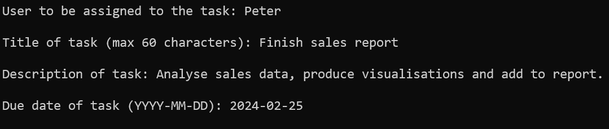
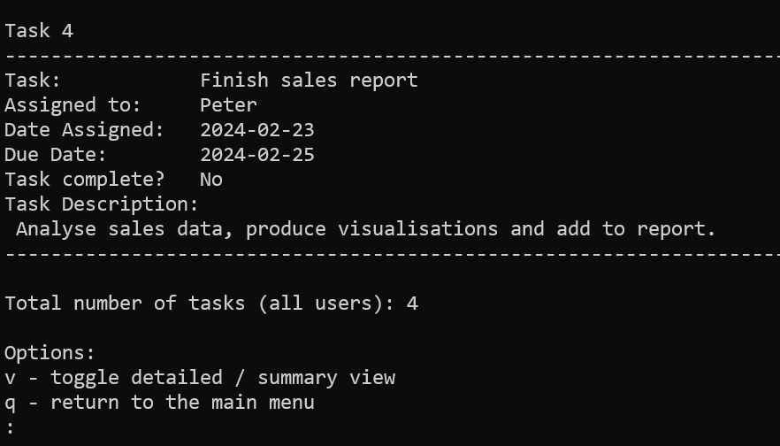
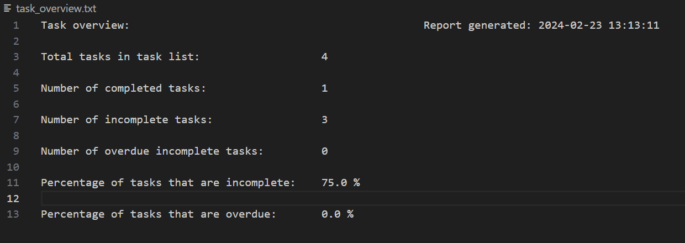
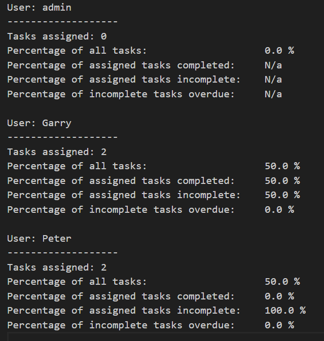

# 📂 Task Manager

## About this project

This is a task management program that allows the user to:

* add new users and tasks
* view all tasks or their own assigned tasks
* edit the due date of a task and its assigned user 
* mark a task as complete
* generate .txt reports showing statistics about users and tasks

## Table of contents

[Installation](https://github.com/Pidgety/Task-manager#installation)

[Technologies](https://github.com/Pidgety/Task-manager#technologies)

[Setup](https://github.com/Pidgety/Task-manager#setup)

* [Register a user](https://github.com/Pidgety/Task-manager?tab=readme-ov-file#register-a-user)

* [Add a task](https://github.com/Pidgety/Task-manager?tab=readme-ov-file#add-a-task)

* [View all tasks](https://github.com/Pidgety/Task-manager?tab=readme-ov-file#view-all-tasks)

* [View my tasks](https://github.com/Pidgety/Task-manager?tab=readme-ov-file#view-my-tasks)

* [Generate reports](https://github.com/Pidgety/Task-manager?tab=readme-ov-file#generate-reports)

[Potential improvements](https://github.com/Pidgety/Task-manager?tab=readme-ov-file#potential-improvements)

[Learning](https://github.com/Pidgety/Task-manager?tab=readme-ov-file#learning)


## Technologies

This project was created using:

* Python 3.12

The project uses the Tabulate library,
which can be installed from the command line:

```
pip install tabulate
```

For information on installing Python 3, please see the link below:

https://www.python.org/downloads/


## Setup

To run this project, save the following file locally:

* task_manager.py

To run the script:

* open the terminal or command-line interface
* navigate into the folder containing the file
* for Windows, enter the following command :
```
python task_manager.py
```
* for Mac/Linux:
```
python3 task_manager.py
```

## Instructions for use

Please note, when first using the program, you will need to log in with the following default user details:

username: **admin**\
password: **password**

On starting, the program creates the following .txt files if they don't already exist, and retrieves any data they contain:

* user.txt - this stores each user's username and password on a separate line with the format **username;password**
* tasks.txt - this stores data about each task on a separate line, with values separated by semicolons.

### Main menu options:

### Register a user

* Enter a username between 5 and 15 characters
    
* Enter and confirm password between 8 and 20 characters

* **Note:** The program does not allow duplicate usernames.

### Add a task

* Enter the name of the user to be assigned to the task. **Note:** only registered users can be assigned a task and the program provides a list of registered users if one is not entered on the first attempt.

* Enter the title of the task and a task description

* Enter a due date for the task.  **Note** this must be equal to or later than the current day.

  Example:

  


### View all tasks

* This option shows details of all the tasks assigned to all users.  It also displays the date on which the task was created and whether the task has been marked as complete.

  Example (for the task added above):

  

* As shown above, there is also the option to toggle between a detailed and summary view (which shows each task on one line)

### View my tasks

* This option allows the current user to view and select one of their own assigned tasks. When selecting a task, the user is presented with the following options:

  * mark the task as completed - **Note:** the user will be prompted to confirm this, as marking a task complete prevents further editing.

  * change the due date (if the task is not marked as complete).  **Note:** the new date must be equal to or later than the current date

  * change the assigned user (if the task is not marked as complete).  **Note:** the new user to be assigned must be registered, and a list of registered usernames is displayed.

### Generate reports

* This creates two .txt overview reports in the current directory if they do not already exist:

* task_overview.txt - provides a summary of all tasks (see example below):
  
  

* user_overview.txt - provides a summary of the status of tasks assigned to each user (see example below):

  

## Potential improvements

* the addition of a graphical user interface
* the ability to sort and filter tasks by due date and completion status

## Learning

Through working on this project, I improved my knowledge of

* making code more modular through use of functions
* error handling
* I/O operations - writing and reading from .txt files
* handling time and date comparison
